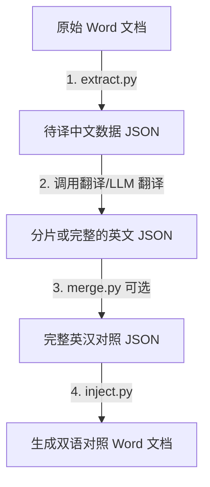

# 📖 Word 高保真双语翻译器 (docx_bilingual_translator)

[](https://www.python.org/)
[](https://python-docx.readthedocs.io/)
[](#-高级排版效果方案示范)

这是一个专门针对 Microsoft Word (`.docx`) 文档的高保真**中英双语对照化**全自动解决方案。通过在原有中文段落和表格单元格下方追加**格式化英文 Runs**，实现完美保真的双语排版（图片、字体加粗、表格合并、超链接等格式不受损）。

---

## ✨ 核心亮点

*   **🛡️ 100% 格式无损**：传统的翻译工具常采用整段重写或直接覆盖的方法，这会导致 Word 中的局部加粗、变红、高亮或图片全部丢失。本项目采用 **Paragraph Run 级文本追加方案**，原中文 Runs 与格式毫发无损，仅在段落内部新增英文 Runs。
*   **🧩 物理级单元格去重**：完美解决 `python-docx` 遍历合并单元格（Merged Cells，如跨行/跨列）时的**重复提取**和**重复回写**地雷。通过底层 XML 的 `_tc` 句柄，实行表格级全局唯一物理去重，排版绝不崩溃。
*   **🎨 高度可定制的英文样式**：英文部分为独立 Run 节点，支持独立微调字号大小、中英对比色（RGB）以及斜体强调样式。

---

## 📂 渐进式目录结构

为了极速上手且保持项目视界清爽，本技能采用**渐进式披露原则**进行架构设计：

```text
docx_translator_skill/
├── SKILL.md                          # 最简化主入口与核心操作（AI 技能读取指引）
├── README.md                         # 👈 【本文件】极速上手与配色参数指南
├── scripts/                          # 核心运行脚本
│   ├── extract.py                    # 1. 待译中文文本无损提取器
│   ├── merge.py                      # 2. 翻译分片合并器（大文件分批处理时使用）
│   └── inject.py                     # 3. 双语样式注入器（回填翻译并美化）
├── examples/                         # 标准格式输入输出数据示例
│   ├── sample_source.json            # 提取出的待译中文源数据
│   ├── sample_result.json            # 翻译完毕的完整英汉映射数据
│   ├── trans_result_part1.json       # 分片翻译结果 1
│   └── trans_result_part2.json       # 分片翻译结果 2
└── references/                       # 深度技术底层与避坑文档
    ├── table_deduplication.md        # 表格物理合并单元格全局去重原理
    └── style_customization.md        # Word 段落 Runs 样式微调底层细节
```

---

## 🚀 极速上手

### 1. 安装依赖

本项目基于 Python 3 开发，仅依赖 `python-docx` 库来读取和操作 Word 结构：
```bash
pip install python-docx
```

### 2. 标准三步工作流



#### 步骤一：提取待译文本
提取原始中文 Word 文档（例如桌面的 `manual.docx`）中所有包含中文的段落和表格内容，保存为 JSON 数据。
```bash
python3 scripts/extract.py --input "~/Desktop/manual.docx" --output "examples/sample_source.json"
```

#### 步骤二：合并翻译分片（可选）
如果您对大文档进行了分片翻译（例如分成了 Part 1 和 Part 2），您可以使用合并脚本将它们拼装为完整的映射：
```bash
python3 scripts/merge.py \
  --part1 "examples/trans_result_part1.json" \
  --part2 "examples/trans_result_part2.json" \
  --output "examples/sample_result.json"
```

#### 步骤三：注入翻译并美化
将翻译好的英文数据回写注入到原始 Word 中，英文段落将以**段内换行**的形式追加入中文下方。
```bash
python3 scripts/inject.py \
  --input "~/Desktop/manual.docx" \
  --translation "examples/sample_result.json" \
  --output "~/Desktop/manual_bilingual.docx"
```

---

## 🛠️ 命令行参数配置详解

### 1. `extract.py` (文本提取器)

| 参数 | 快捷键 | 默认值 | 作用与说明 |
| :--- | :--- | :--- | :--- |
| `--input` | `-i` | `~/Desktop/manual.docx` | 待提取的原始中文 Word 文档路径 |
| `--output` | `-o` | `examples/sample_source.json` | 提取出的中文 JSON 字典保存路径 |

### 2. `merge.py` (翻译分片合并器)

| 参数 | 默认值 | 作用与说明 |
| :--- | :--- | :--- |
| `--part1` | `examples/trans_result_part1.json` | 第一个分片 JSON 文件的路径 |
| `--part2` | `examples/trans_result_part2.json` | 第二个分片 JSON 文件的路径 |
| `--output` | `examples/sample_result.json` | 合并后的完整英汉映射 JSON 路径 |

### 3. `inject.py` (双语样式注入器)

| 参数 | 快捷键 | 默认值 | 作用与说明 |
| :--- | :--- | :--- | :--- |
| `--input` | `-i` | `~/Desktop/manual.docx` | 待注入的原始中文 Word 文档路径 |
| `--translation`| `-t` | `examples/sample_result.json` | 已经翻译好的 JSON 字典路径（必须包含 `"en"` 字段） |
| `--output` | `-o` | `~/Desktop/manual_bilingual.docx` | 生成的双语对照 Word 保存路径 |
| `--para-size` | / | `10.0` | 正文中英文的字号大小（单位：pt） |
| `--table-size` | / | `9.5` | 表格单元格中英文的字号大小（单位：pt） |
| `--color` | / | `"31,78,121"` | 英文的 RGB 颜色（格式为 `"R,G,B"`） |
| `--no-italic` | / | `False` | 禁用斜体（默认会使用斜体以与中文产生视觉区隔） |

---

## 🎨 高级排版效果方案示范

为了让双语手册显得更加精致专业，我们调试并推荐以下三套英文排版视觉配色：

### 🌟 方案 A：优雅商务风（默认）
> 视觉对比强烈，中英主次极为分明，非常适合企业内部的正式操作指南与说明手册。
```bash
python3 scripts/inject.py \
  --para-size 10.0 \
  --table-size 9.5 \
  --color "31,78,121"
```
*   **字体大小**：正文 10pt，表格 9.5pt
*   **颜色**：经典深邃蓝 (RGB: `31, 78, 121`)
*   **样式**：斜体强调

### 🌫️ 方案 B：莫兰迪冷灰风
> 简约清爽，低调不抢眼，适合字数本身极为密集的文档，降低长时间阅读的视觉疲劳。
```bash
python3 scripts/inject.py \
  --para-size 10.5 \
  --table-size 10.0 \
  --color "100,100,100"
```
*   **字体大小**：正文 10.5pt，表格 10pt
*   **颜色**：中性深灰 (RGB: `100, 100, 100`)
*   **样式**：斜体强调

### 🧪 方案 C：硬核科技风
> 现代科技感十足，不使用斜体，适合带有高频代码指令、代码变量、技术规格的手册。
```bash
python3 scripts/inject.py \
  --para-size 9.5 \
  --table-size 9.0 \
  --color "0,128,128" \
  --no-italic
```
*   **字体大小**：正文 9.5pt，表格 9pt
*   **颜色**：暗青绿 (RGB: `0, 128, 128`)
*   **样式**：标准常规体

---

## 📚 底层原理解密

如果您想深入二次开发或了解更多机制，建议参阅以下深度文档：

1.  **[合并单元格全局去重原理](file:///Users/shenweitao/Desktop/docx_translator_skill/references/table_deduplication.md)**：
    *   深度剖析了 `python-docx` 遍历合并单元格时产生多次冗余提取/重复覆盖写入的底层原因。
    *   解密了如何通过底层 XML 的 `cell._tc` 句柄进行内存级唯一性去重。
2.  **[Run 级段内换行无损样式自定义](file:///Users/shenweitao/Desktop/docx_translator_skill/references/style_customization.md)**：
    *   解析了为什么直接修改 `paragraph.text` 会导致 Word 的全部样式退化崩溃。
    *   阐述了使用 `paragraph.add_run("\n" + translation)` 局部追加字符样式以及字体控制的 XML 原理。

---

## 🤝 许可证
本工具链完全开源，可自由基于此开发您自定义的翻译器。
